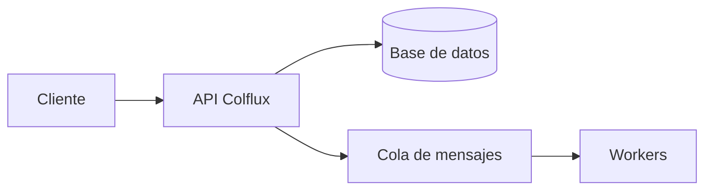

# Diagramas de arquitectura

Ejemplo de diagrama con Mermaid (soportado nativamente por esta config de MkDocs):

```mermaid
flowchart LR
    Client[Cliente] --> API[API Colflux]
    API --> DB[(Base de datos)]
    API --> Queue[Cola de mensajes]
    Queue --> Worker[Workers]
```

Reemplaza este diagrama por los diagramas reales de la plataforma.
